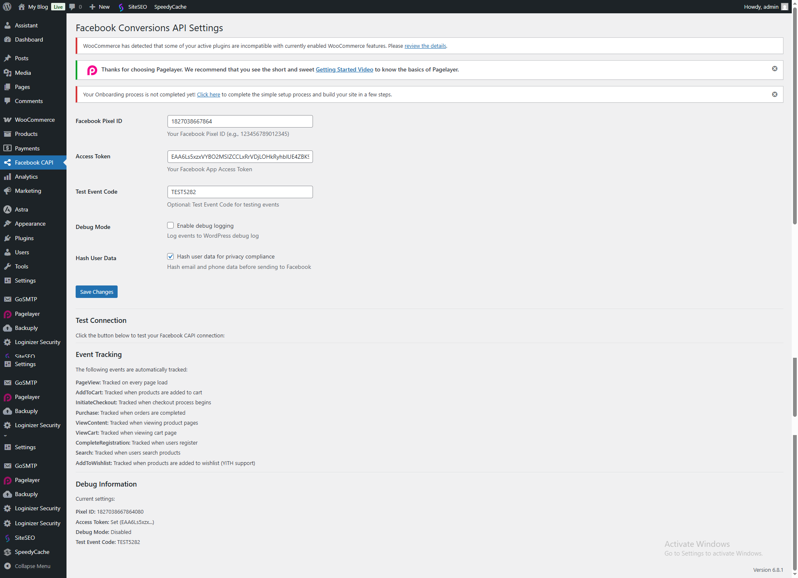

# WooCommerce Facebook Conversions API

[](https://www.gnu.org/licenses/gpl-2.0.html)
[](https://woocommerce.com/)
[](https://wordpress.org/)

> **Send WooCommerce events to Facebook’s Conversions API (CAPI) server-side for advanced tracking, deduplication, and privacy compliance.**

---

## 🌐 Project Link

**GitHub:** [https://github.com/bigboss821/woocommerce-facebook-conversions-api](https://github.com/bigboss821/woocommerce-facebook-conversions-api)

---

## 🚀 Features

- **Server-Side Event Tracking:** Send all major WooCommerce events (Purchase, AddToCart, InitiateCheckout, etc.) directly to Facebook CAPI.
- **Best-Practice Deduplication:** Unique event IDs for each event, with session-based deduplication and JS variable injection for Pixel matching.
- **Privacy & Compliance:** User data is hashed before sending, with full GDPR/CCPA compliance options.
- **Admin Controls:**
  - Settings page for Pixel ID, Access Token, Test Event Code, Debug Mode, and more.
  - Option to auto-send or manually send Purchase events.
  - Manual “Send to Facebook CAPI” button in order details and preview popup.
  - Status column in order list: Sent, Pending, N/A.
- **Debug & Logging:** Enable debug mode for detailed logs and error tracking.
- **Modern UI:** Clean, user-friendly admin interface.

---

## ⚙️ Setup

1. **Download** the latest release from [GitHub Releases](https://github.com/bigboss821/woocommerce-facebook-conversions-api/releases).
2. **Upload** the ZIP file via WordPress Admin > Plugins > Add New > Upload.
3. **Activate** the plugin.
4. Go to **Facebook CAPI** to configure your settings.

---

## 📸 Screenshots

| Orders List with CAPI Status | Order Preview with Manual Send & Debug |
|-----------------------------|----------------------------------------|
|  |  |

> _Replace the above image links with your actual screenshots if available._

---

## 🧑‍💻 Contribution

Pull requests are welcome! For major changes, please open an issue first to discuss what you would like to change.

**How to contribute:**
1. Fork the repo
2. Create your feature branch (`git checkout -b feature/your-feature`)
3. Commit your changes (`git commit -am 'Add new feature'`)
4. Push to the branch (`git push origin feature/your-feature`)
5. Open a Pull Request

---

## 💬 Support

For issues, feature requests, or questions, please [open an issue](https://github.com/bigboss821/woocommerce-facebook-conversions-api/issues) on GitHub.

---

> Made with ❤️ for the WooCommerce & Facebook community.


3. **ইভেন্ট অনুপস্থিত**
   - সঠিক WooCommerce hooks কাজ করছে কিনা দেখুন
   - ইভেন্ট ফিল্টার হচ্ছে কিনা যাচাই করুন
   - Facebook Pixel কনফিগারেশন যাচাই করুন
  
# 📸 Screenshots Guide

Welcome to the **Screenshots** folder for the WooCommerce Facebook Conversions API plugin!

---

## 🗂️ What to Include

Add clear, high-quality screenshots that showcase the plugin in action. Recommended screenshots:

- 🛒 **Orders List:** Showing the CAPI status column
- 👁️ **Order Preview Popup:** With the manual send button and debug info
- ⚙️ **Plugin Settings Page:** All available options
- ✅ **Success/Error Messages:** (if relevant)

---

## 📝 Naming Convention

- Use short, descriptive, lowercase file names:
  - `orders-list.png`
  - `order-preview.png`
  - `settings-page.png`
  - `success-message.png`

---

## 🖼️ How to Update the Main README

1. Place your screenshot files in this `screenshots/` folder.
2. In the main `README.md`, update the image links:
   ```markdown
   
   ```
3. Commit both the images and the updated README.

---

## 🤝 Contribution Tips

- Only use real plugin UI (no mockups or unrelated images).
- Crop screenshots to focus on the relevant area.
- Update screenshots if you change the UI or add new features.
- Keep file sizes reasonable for fast loading.

---

> Thank you for helping make this project more user-friendly and visually clear! 
